# ATC Booktique (Library Management System using JSP)

> It is my internship project in which we have to manage the companies Library by adding the different modules like Librarian,Admin,Member(Employees) and Books through a interactive interface built in HTML/CSS/Javascript. The Portal is basically divided into 2 parts Admin Portal and Librarian Portal according to their rights and power to change the system.

#### Librarian Login Portal and Admin Login Portal:
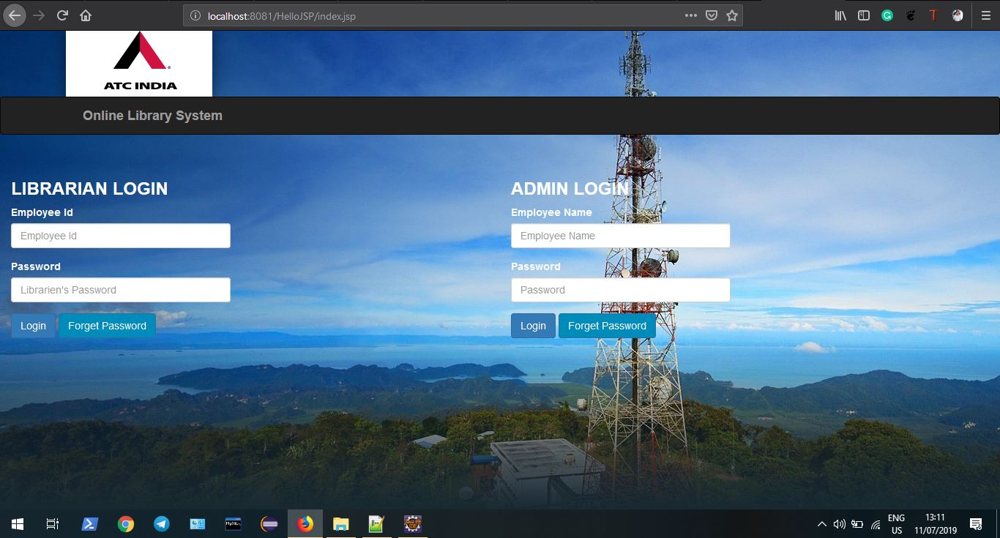

### Advanced Features  Implemented :
* One-click database export in CSV format:
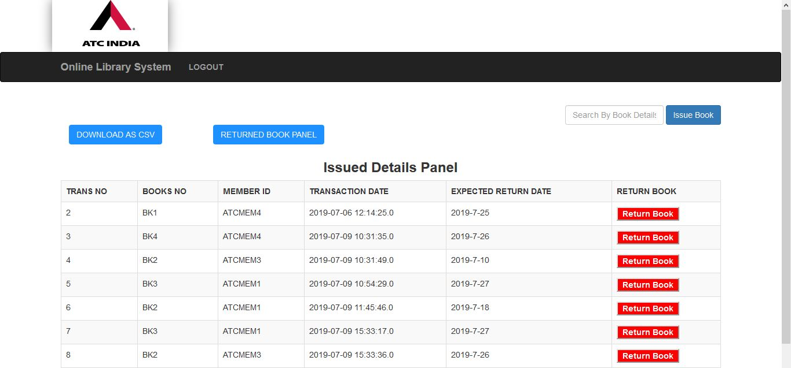
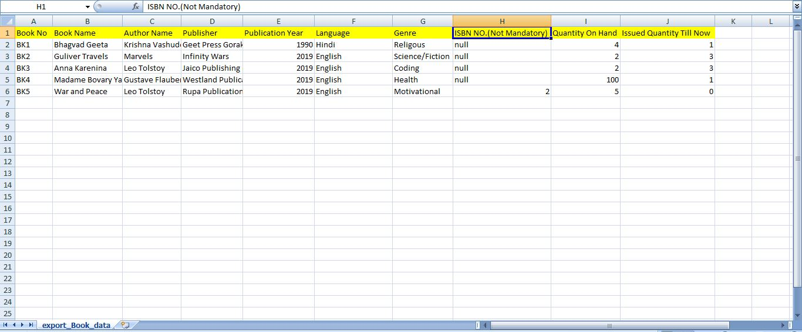
* Session Management(to reduce illegal access to any files and folders)
* Dynamic Modal Box using Bootstrap for ADD modules.
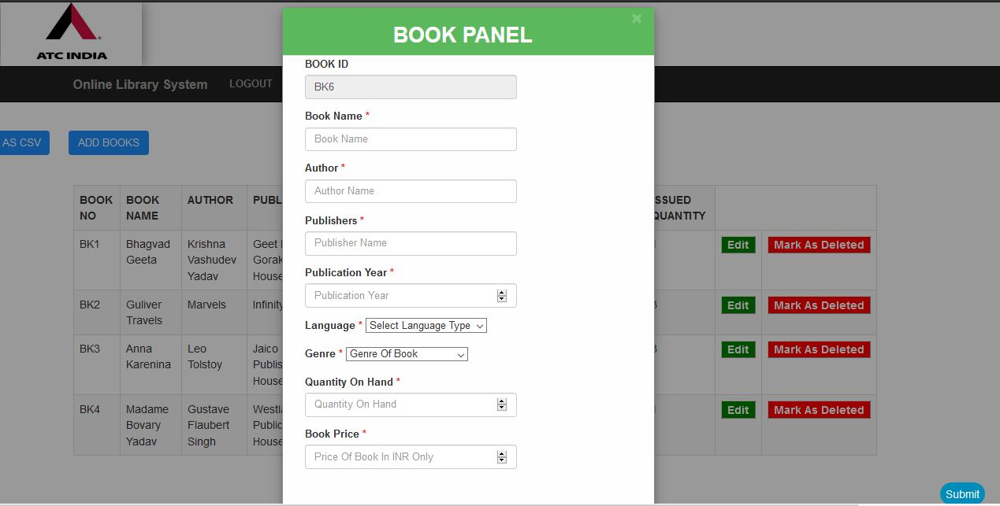
* Search Panel For Dynamic Searching:   
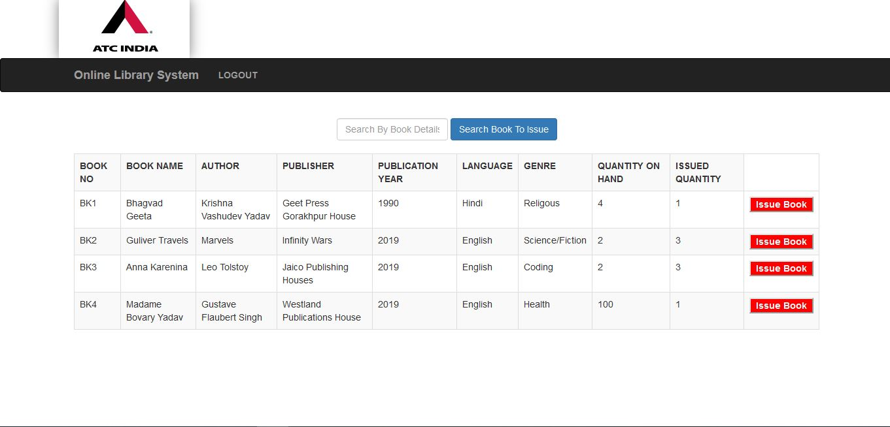
   
   
 + [Development](#development)
 + [Contribute](#contribute)
 + [Technology Stack Used](##technoogy used)
 + [Setup](#setup)
 + [Features](#features)
 + [Screenshots](#screenshots)

## Development
The backend of the system is developed on **[MySQL Command Line Client/MySQL Workbench](https://www.mysql.com/)** and it is free and open source. You just need to download the jar file and import it to the **Eclipse Ide** in the directory of the Project. I generally prefer the Command Line Client than Workbench, as it would help you to be proficient in learning SQL.:boom::smiley:

The front end is built on **[JSP](https://www.javatpoint.com/)**, you can refer to the different tutorials while developing the project to learn more about it and  it is also built on the [Bootstrap v2.2.2](http://bootstrapdocs.com/v2.2.2/docs/) using [jQuery](https://blog.jquery.com/2013/02/04/jquery-1-9-1-released/) and [Ajax](https://www.w3schools.com/xml/ajax_intro.asp) and basic HTML/CSS/Javascript.

## Contribute
+ For reporting bug about an incorrect file not being processed, open a new issue.
+ PRs are always welcome to improve exisiting system and documentation too.

### Default Login Credentials For Admin
| Username  | Password |
| ------------- | ------------- |
| raja  | rahul  |

### Default Login Credentials For Librarian
| Username  | Password |
| ------------- | ------------- |
| LIB001  | rahul  |

### Technology Used
  * [JSP](https://github.com/jfoenixadmin/JFoenix) - JSP For Creating JDBC Driver Link and Fetching/Updating Records
  * [Ajax](https://db.apache.org/derby/) - Dynamic Searching For Filtering Records
  * [Servelet](https://commons.apache.org/) - For creating SHA hash
  * [JSON](https://github.com/google/gson) - JSON Library, for storing configurations
  * [Google API's](https://bitbucket.org/Jerady/fontawesomefx) - For Creating Dynamic Reports at Server Side

## Setup

### Prerequisite: Install MySQL (for Linux)

> If you don't already have the MySQL Database Server(My MySQL Server Version 5.5) installed, you will need to install it to use this project. If it is installed, you can skip to step 4.

1. Oracle provides detailed instructions to install MySQL on any Linux distribution. See ["Installing MySQL on Linux"](https://dev.mysql.com/doc/refman/8.0/en/linux-installation.html) for details and instructions. 
2. Altneratively, you can probably install a working MySQL server that is compatible with this project by running:

`apt-get update && apt-get install mysql-server`

3. *You may be prompted to choose a root password for MySQL during the installation.*
4. You should [create a MySQL user](https://dev.mysql.com/doc/refman/8.0/en/adding-users.html) for this project, [create a database](https://dev.mysql.com/doc/refman/8.0/en/create-database.html) for this project, and may need to give the mysql user permissions to access the database. Instructions to configure the project are provided below.
5. For my project the username of the **MySQL User**  is **rahul** and password for the **MySQL User** is **pass**.

### Unix / Linux / Mac Setup

*NOTE:* Tomcat Server Version 8.0 or above,MySQL Server Version 5.5 or above and Eclipse Ide For Java EE Developers:

*Your Eclipse Project Directory will look like this after the required dependecny are installed:*

#### Overview Of MYSQL Command Client with Tables Inserted

* My MYSQL root password is rahul.**
### Windows Setup

*Some notes on Windows setup:*

**MySQL setup**

* Open this link to [Download MySQL Workbench](https://dev.mysql.com/downloads/).

* Scroll to the bottom and select *Microsoft Windows* in the *Select your Operating System* dropdown.

* Click *download* button in front of *Windows (x86, 64-bit), MSI Installer* at the bottom.

* Right-click the downloaded MSI file and select the Install item from the pop-up menu, or double-click the file.

* In the Setup Type window you may choose a Complete or Custom installation. To use all features of MySQL Workbench choose the Complete option.

* Unless you choose otherwise, MySQL Workbench is installed in `C:\%PROGRAMFILES%\MySQL\MySQL Workbench 8.0 edition_type\`, where `%PROGRAMFILES%` is the default directory for programs for your locale. The `%PROGRAMFILES%` directory is defined as `C:\Program Files\` on most systems.

**Eclipse Setup in Windows**
With the above notes in mind, Eclipse setup is not too tricky:

* Open git shell;

* `git clone https://github.com/irahulcse/ATC.git`;

* `cd ATC`;

* You need to import the project(Open Project from File System) in the eclipse directly.

* Now you  need to add the required  Tomcat Server Jar Files and MySQL Jar file in the project directory for running the project. 

#### Finally the Eclipse Directory will look like this: 
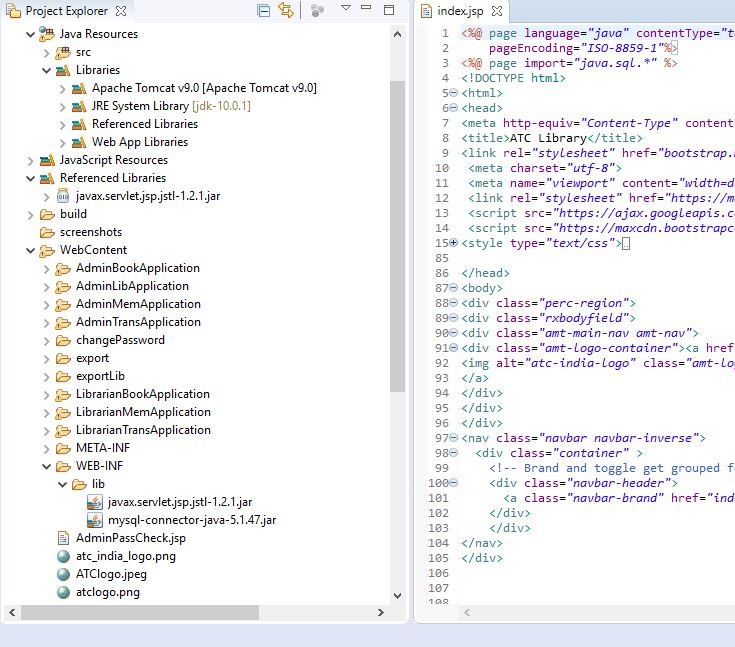

* **NOTE:** Now you have to create the database first(My Project database name is lib) and after of database creation, you need to import the different tables in the database lib:

* Below is the command to import the tables in the mysql command line client without any hassle:

* **NOTE:** mem.sql is the table for the books table present in the git folder:

* `source C:\Users\Rahul Chandra\Downloads\eclipse\eclipse-workspace-new\HelloJSP\books.sql`
* Do the same for the mem,trans,librarian and admin table present in the directory.
#### And your Tables in the lib Database will look like this:
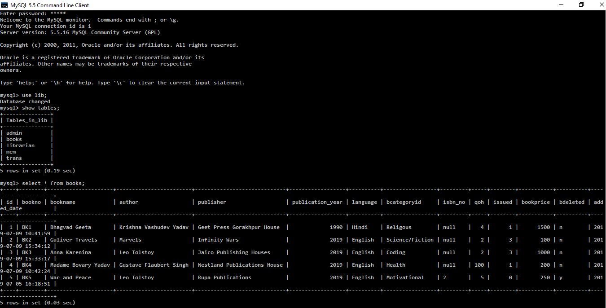

## Features
 + Admins and Librarians can be given their authorized login ID and password without which the system can not be accessed and all the sessions are maintained through that same Id and Password.
 + Admin is more of the supreme or you can say a Senior Vice President Person who commands and monitors the progress.
 + Librarian's can access only the his portal with funcationalities related to the Members(Employees), Book, Transactions.
 + Admin and Librarian's can download/export the database in One-click in their own system.
 + Admin and Librarian can **Update** data and **Mark As Deleted**(i.e flag the data in table from n to y/ One of the **important** feature used in the Companies at big level).As no data is ever deleted it just **Mark As Deleted**.
 + We could be only able to issue the book to not more than 2 books to any Employee at one time.
 + We would be able to generate the dynamic reports through **Google API's and JSON** which would help the authority to find different important information System about the Librarian.
 + **Login and Logout Functionaly with Session Maintanence is taken with the help of Servlet**.
 + Admin and Librarian could change the password for the security purpose after every 10 days.

## Screenshots
#### Admin Panel(After Login):

#### Book Section:
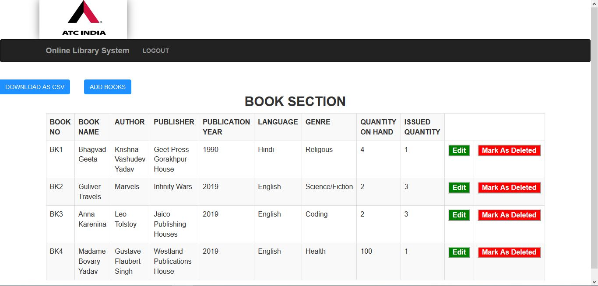

#### Bootstrap based Add Book Pop Up:

#### Delete Book Confirmation Box:

#### Member Section:

#### Update Member Details:

#### Issued Book Section:
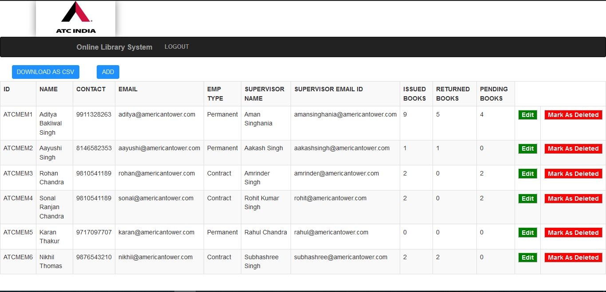
#### Search Book Section/ Issue Book Confirmation:
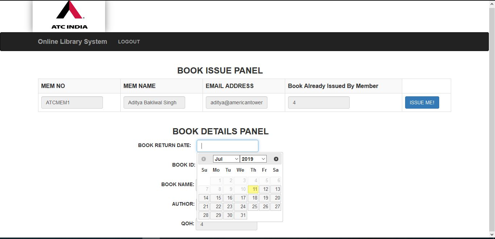
#### Search Employee Section:
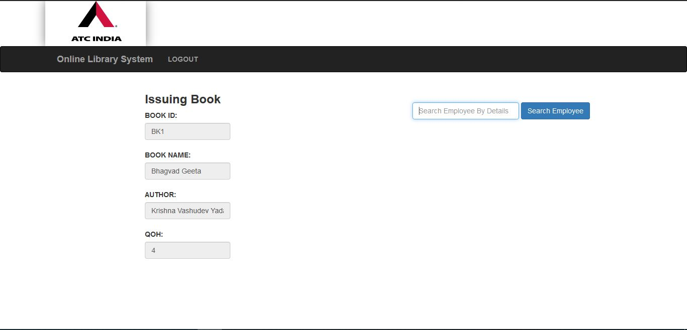
#### Returned Book Section(Already Returned Book):
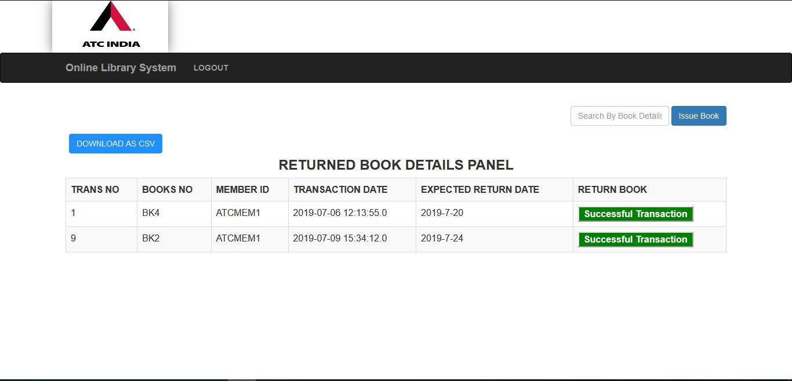
#### Forget/Reset Admin and Librarian Password:
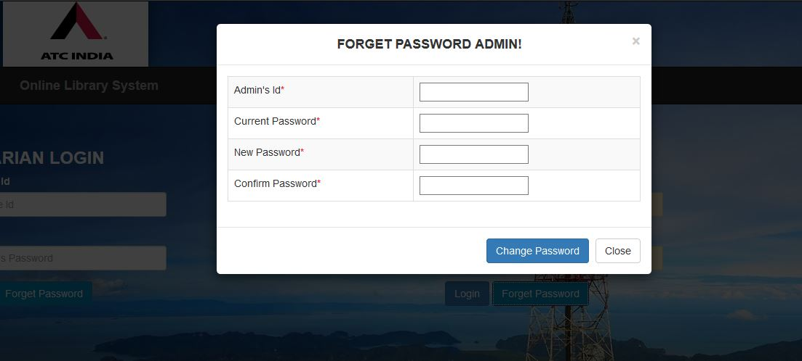

#### Exported Records in Local System:

